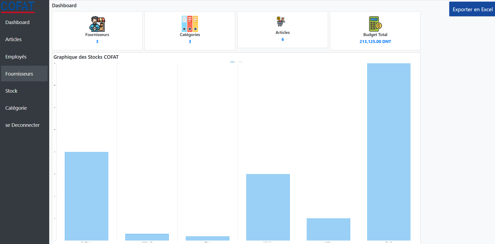

# 📦 Stock Management App - COFAT

<div align="center">


**Application web complète pour la gestion des stocks et des inventaires**

[Fonctionnalités](#-fonctionnalités) • [Installation](#-installation) • [Documentation](#-structure-du-projet) • [Contribution](#-contribution)

</div>

---

## 📋 Table des matières

- [À propos](#-à-propos)
- [Fonctionnalités](#-fonctionnalités)
- [Technologies](#-technologies)
- [Prérequis](#-prérequis)
- [Installation](#-installation)
- [Configuration](#-configuration)
- [Utilisation](#-utilisation)
- [Structure du projet](#-structure-du-projet)
- [Base de données](#-base-de-données)
- [Captures d'écran](#-captures-décran)
- [Roadmap](#-roadmap)
- [Contribution](#-contribution)
- [Auteur](#-auteur)

---

## 🎯 À propos

**Stock Management App** est une application web développée pour faciliter la gestion complète des stocks pour l'entreprise COFAT. Elle permet de gérer les articles, les fournisseurs, les employés, les catégories et de suivre l'état des stocks en temps réel avec des fonctionnalités d'export Excel.

> 🎓 **Projet de stage de perfectionnement** - Développé dans le cadre d'un stage professionnel

### Objectifs du projet
- ✅ Simplifier la gestion quotidienne des stocks
- ✅ Centraliser les informations produits et fournisseurs
- ✅ Générer des rapports et exports automatisés
- ✅ Offrir une interface intuitive et responsive

---

## ✨ Fonctionnalités

### 🛒 Gestion des Articles
- ➕ Ajouter de nouveaux articles avec prix, quantité et catégorie
- ✏️ Modifier les informations des articles existants
- 🗑️ Supprimer des articles avec confirmation
- 🔍 Visualiser tous les articles dans un tableau interactif

### 📊 Gestion des Stocks
- 📦 Suivre les quantités en stock par emplacement
- 🏪 Gérer plusieurs emplacements (Entrepôt Principal, Magasin Tunis, Magasin Sfax...)
- ⚠️ Alertes pour les stocks bas
- 📍 Localisation précise des articles

### 👥 Gestion des Utilisateurs
- 👤 Gestion des employés et administrateurs
- 🔐 Système d'authentification sécurisé
- 👨‍💼 Rôles et permissions différenciés

### 🏢 Gestion des Fournisseurs
- 📇 Base de données complète des fournisseurs
- 📞 Informations de contact (téléphone, email, adresse)
- 🔗 Association articles-fournisseurs

### 🗂️ Gestion des Catégories
- 📑 Organisation des articles par catégories
- ➕ Création de catégories personnalisées
- 🏷️ Classification facile des produits

### 📈 Dashboard
- 📊 Vue d'ensemble des statistiques
- 📉 Graphiques et métriques clés
- 🔔 Alertes et notifications

### 📤 Export de données
- 📊 Export Excel (.xlsx) avec PhpSpreadsheet
- 📄 Export CSV pour compatibilité universelle
- 🎨 Mise en forme automatique des exports

---

## 🛠️ Technologies

### Backend
- **PHP 7.4+** - Langage serveur principal
- **MySQL 5.7+** - Base de données relationnelle
- **PDO** - Interface d'accès aux données sécurisée

### Frontend
- **HTML5 & CSS3** - Structure et style
- **Bootstrap 5.3** - Framework CSS responsive
- **JavaScript (ES6+)** - Interactivité côté client
- **SweetAlert2** - Popups et confirmations élégantes

### Bibliothèques
- **PhpSpreadsheet** - Génération de fichiers Excel
- **Composer** - Gestionnaire de dépendances PHP

### Serveur local
- **WAMP Server** - Environnement de développement local

---

## 📦 Prérequis

Avant de commencer, assurez-vous d'avoir installé :

- ✅ **PHP >= 7.4** ([Télécharger](https://www.php.net/downloads))
- ✅ **MySQL >= 5.7** ou **MariaDB >= 10.2**
- ✅ **Apache 2.4** (inclus dans WAMP)
- ✅ **Composer** ([Télécharger](https://getcomposer.org/download/))
- ✅ **WAMP Server** ([Télécharger](https://www.wampserver.com/))
- ✅ Un navigateur web moderne (Chrome, Firefox, Edge)

### Extensions PHP requises
```ini
extension=pdo_mysql
extension=mbstring
extension=zip
extension=gd
```

---

## 📥 Installation

### Étape 1 : Cloner le projet
```bash
# Cloner dans le répertoire www de WAMP
cd C:/wamp64/www
git clone https://github.com/votre-username/stock-management-app.git
cd stock-management-app
```

### Étape 2 : Installer les dépendances
```bash
composer install
```

### Étape 3 : Importer la base de données
1. Démarrer **WAMP Server**
2. Ouvrir **phpMyAdmin** : `http://localhost/phpmyadmin`
3. Créer une nouvelle base de données : `gestion_de_stock_cofat`
4. Importer le fichier SQL :
   - Sélectionner la base `gestion_de_stock_cofat`
   - Onglet **Importer**
   - Choisir le fichier `database/database.sql`
   - Cliquer sur **Exécuter**

---

## ⚙️ Configuration

Modifier le fichier `connexionbase.php` :
```php
<?php
define('DB_HOST', 'localhost');
define('DB_NAME', 'gestion_de_stock_cofat');
define('DB_USER', 'root');
define('DB_PASS', '');
```

---

## 🚀 Utilisation

1. **Démarrer WAMP Server** (icône verte)
2. **Accéder à l'application** : `http://localhost/stock-management-app`
3. **Se connecter** avec les identifiants par défaut :
   - **Username :** `admin`
   - **Password :** `admin123`

---

## 📁 Structure du projet
```
stock-management-app/
│
├── 📂 database/
│   └── database.sql              # Script SQL de la base de données
│
├── 📂 vendor/                    # Dépendances Composer (PhpSpreadsheet)
│
├── 📄 article.php                # Gestion des articles (Admin)
├── 📄 article_user.php           # Consultation des articles (User)
├── 📄 categorie.php              # Gestion des catégories
├── 📄 connexionbase.php          # Connexion à la base de données
├── 📄 dashboard.php              # Tableau de bord administrateur
├── 📄 dashboard_user.php         # Tableau de bord utilisateur
├── 📄 excel.php                  # Module d'export Excel
├── 📄 export_excel.php           # Export Excel des données
├── 📄 fournisseur.php            # Gestion des fournisseurs
├── 📄 generate.php               # Génération de rapports
├── 📄 login_admin.php            # Connexion administrateur
├── 📄 login_user.php             # Connexion utilisateur
├── 📄 page_home.html             # Page d'accueil
├── 📄 stock.php                  # Gestion des stocks (Admin)
├── 📄 stock_user.php             # Consultation des stocks (User)
├── 📄 user.php                   # Gestion des utilisateurs
├── 📄 composer.json              # Configuration Composer
├── 📄 composer.lock              # Verrouillage des dépendances
├── 📄 README.md                  # Documentation du projet
│
└── 📂 Images/
    ├── a.png                     # Image pour interface
    ├── b.jpeg                    # Image pour interface
    ├── bg.png                    # Image de fond
    ├── c.jpeg                    # Image pour interface
    ├── f.png                     # Image pour interface
    ├── login-page.jpg            # Image de la page de connexion
    ├── logo.png                  # Logo de l'application
    ├── OIP.jpg                   # Image d'illustration
    ├── OIP.webp                  # Image d'illustration
    └── profile.png               # Image de profil
```

### Description des fichiers principaux

| Fichier | Description |
|---------|-------------|
| `connexionbase.php` | Configuration de la connexion MySQL via PDO |
| `login_admin.php` | Authentification des administrateurs |
| `login_user.php` | Authentification des utilisateurs standards |
| `dashboard.php` | Tableau de bord avec statistiques pour admin |
| `dashboard_user.php` | Tableau de bord pour utilisateurs standards |
| `article.php` | CRUD complet des articles (admin) |
| `article_user.php` | Consultation des articles (user) |
| `stock.php` | Gestion des stocks et emplacements |
| `stock_user.php` | Consultation des stocks (user) |
| `categorie.php` | Gestion des catégories de produits |
| `fournisseur.php` | Gestion des fournisseurs |
| `user.php` | Gestion des comptes utilisateurs |
| `export_excel.php` | Export des données en Excel |
| `generate.php` | Génération de rapports personnalisés |
| `page_home.html` | Page d'accueil de l'application |

---

## 🗄️ Base de données

**Nom de la base :** `gestion_de_stock_cofat`

### Tables principales

| Table | Description | Nombre de lignes |
|-------|-------------|------------------|
| `admin` | Administrateurs du système | - |
| `articles` | Liste complète des articles | - |
| `categories` | Catégories de produits | - |
| `fournisseurs` | Liste des fournisseurs | - |
| `stock` | État des stocks par emplacement | - |
| `user` | Utilisateurs standards | - |

### Schéma détaillé des tables

#### Table : `admin`
```sql
CREATE TABLE admin (
    id_admin INT PRIMARY KEY AUTO_INCREMENT,
    username VARCHAR(50) NOT NULL UNIQUE,
    password VARCHAR(255) NOT NULL,
    email VARCHAR(100),
    date_creation TIMESTAMP DEFAULT CURRENT_TIMESTAMP
);
```
- **Identifiants par défaut :**
  - Username : `admin`
  - Password : `admin123` (hashé en base)

---

#### Table : `articles`
```sql
CREATE TABLE articles (
    id_article INT PRIMARY KEY AUTO_INCREMENT,
    nom_article VARCHAR(255) NOT NULL,
    description TEXT,
    prix_unitaire DECIMAL(10, 2) NOT NULL,
    quantite_stock INT DEFAULT 0,
    id_categorie INT,
    id_fournisseur INT,
    date_creation TIMESTAMP DEFAULT CURRENT_TIMESTAMP,
    date_modification TIMESTAMP DEFAULT CURRENT_TIMESTAMP ON UPDATE CURRENT_TIMESTAMP,
    FOREIGN KEY (id_categorie) REFERENCES categories(id_categorie),
    FOREIGN KEY (id_fournisseur) REFERENCES fournisseurs(id_fournisseur)
);
```
- **Fonction :** Stockage de tous les produits avec leurs détails
- **Relations :** Liée aux tables `categories` et `fournisseurs`

---

#### Table : `categories`
```sql
CREATE TABLE categories (
    id_categorie INT PRIMARY KEY AUTO_INCREMENT,
    nom_categorie VARCHAR(100) NOT NULL UNIQUE,
    description TEXT,
    date_creation TIMESTAMP DEFAULT CURRENT_TIMESTAMP
);
```
- **Fonction :** Classification des articles par catégories

---

#### Table : `fournisseurs`
```sql
CREATE TABLE fournisseurs (
    id_fournisseur INT PRIMARY KEY AUTO_INCREMENT,
    nom_fournisseur VARCHAR(255) NOT NULL,
    telephone VARCHAR(20),
    email VARCHAR(255),
    adresse TEXT,
    ville VARCHAR(100),
    pays VARCHAR(100),
    date_creation TIMESTAMP DEFAULT CURRENT_TIMESTAMP
);
```
- **Fonction :** Gestion des informations fournisseurs

---

#### Table : `stock`
```sql
CREATE TABLE stock (
    id_stock INT PRIMARY KEY AUTO_INCREMENT,
    id_article INT NOT NULL,
    emplacement VARCHAR(255) NOT NULL,
    quantite INT DEFAULT 0,
    seuil_alerte INT DEFAULT 10,
    date_maj TIMESTAMP DEFAULT CURRENT_TIMESTAMP ON UPDATE CURRENT_TIMESTAMP,
    FOREIGN KEY (id_article) REFERENCES articles(id_article) ON DELETE CASCADE
);
```
- **Fonction :** Suivi des stocks par emplacement
- **Emplacements :** Entrepôt Principal, Magasin Tunis, Magasin Sfax, etc.

---

#### Table : `user`
```sql
CREATE TABLE user (
    id_user INT PRIMARY KEY AUTO_INCREMENT,
    username VARCHAR(50) NOT NULL UNIQUE,
    password VARCHAR(255) NOT NULL,
    nom VARCHAR(100),
    prenom VARCHAR(100),
    email VARCHAR(100),
    role ENUM('employe', 'gestionnaire') DEFAULT 'employe',
    date_creation TIMESTAMP DEFAULT CURRENT_TIMESTAMP
);
```
- **Fonction :** Comptes utilisateurs standards (non-admin)

---

### Diagramme des relations
```
┌──────────────┐       ┌──────────────┐       ┌──────────────┐
│  categories  │───┐   │   articles   │   ┌───│ fournisseurs │
└──────────────┘   │   └──────────────┘   │   └──────────────┘
                   │          │           │
                   └──────────┴───────────┘
                              │
                              │ (1:N)
                              │
                       ┌──────┴──────┐
                       │    stock    │
                       └─────────────┘
```

---

## 📸 Captures d'écran

### Structure du projet


### Base de données


### Interface d'administration


---

## 🗺️ Roadmap

### Améliorations futures
- [ ] 🔐 Système de récupération de mot de passe
- [ ] 📱 Version mobile responsive
- [ ] 📊 Rapports statistiques avancés
- [ ] 🔔 Notifications en temps réel
- [ ] 📤 Export PDF des rapports
- [ ] 🌐 API REST pour intégrations
- [ ] 🔄 Gestion des mouvements de stock (entrées/sorties)
- [ ] 📧 Alertes email pour stocks bas

---

## 🤝 Contribution

Les contributions sont les bienvenues ! Pour contribuer :

1. **Fork** le projet
2. **Créer une branche** : `git checkout -b feature/amelioration`
3. **Commit** : `git commit -m 'Ajout d'une fonctionnalité'`
4. **Push** : `git push origin feature/amelioration`
5. **Ouvrir une Pull Request**

---

## 👨‍💻 Auteur

**Votre Nom**

- 🐙 GitHub : [@votre-username](https://github.com/votre-username)
- 📧 Email : votre.email@example.com
- 💼 LinkedIn : [Votre Profil](https://linkedin.com/in/votre-profil)

---

## 🙏 Remerciements

- Entreprise COFAT pour l'opportunité de stage
- [Bootstrap](https://getbootstrap.com/) pour le framework CSS
- [PhpSpreadsheet](https://github.com/PHPOffice/PhpSpreadsheet) pour l'export Excel
- [SweetAlert2](https://sweetalert2.github.io/) pour les notifications

---

<div align="center">

**⭐ Si ce projet vous a été utile, n'hésitez pas à lui donner une étoile ! ⭐**

*Projet de stage de perfectionnement - COFAT 2024*

</div>
